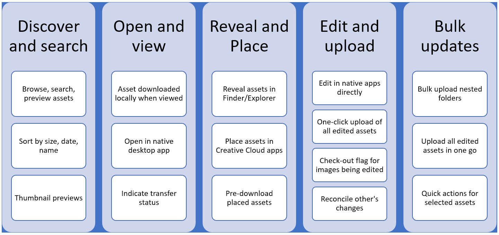

# Bob's test file

Here we go.

## Create Block Definition and Model {#create-block-model}

1&period; Clone the GitHub project locally that you created in the guide and open it in an editor of your choice.

   * Microsoft Code is used here for illustrative purposes.

   

2&period; Edit the `component-definition.json` file at the root of the project and add the following definition for your new quote block and save the file.

>[!BEGINTABS]

>[!TAB JSON Example]

```json
{
  "title": "Quote",
  "id": "quote",
  "plugins": {
    "xwalk": {
      "page": {
        "resourceType": "core/franklin/components/block/v1/block",
        "template": {
          "name": "Quote",
          "model": "quote",
          "quote": "<p>Think, McFly! Think!</p>",
          "author": "Biff Tannen"
        }
      }
    }
  }
}
```

>[!TAB Screenshot]



>[!ENDTABS]

3&period; Edit the `component-models.json` file at the root of the project and add the following  for your new quote block and save the file.

   * Please see the document  for more information about what is important to consider when creating content models.

>[!BEGINTABS]

>[!TAB JSON Example]

```json
{
  "id": "quote",
  "fields": [
     {
       "component": "text-area",
       "name": "quote",
       "value": "",
       "label": "Quote",
       "valueType": "string"
     },
     {
       "component": "text-input",
       "valueType": "string",
       "name": "author",
       "label": "Author",
       "value": ""
     }
   ]
}
```

>[!TAB Screenshot]


>[!ENDTABS]

4&period; Edit the `component-filters.json` file at the root of the project and add the quote block to the  to allow the block to be added to any section and save the file.

## Recommended tutorials on this topic

* [Get started managing a project](https://experienceleague.adobe.com/en/docs/workfront-learn/tutorials-workfront/manage-work/projects/getting-started-manage-a-project.md)
* [Find projects](https://experienceleague.adobe.com/en/docs/workfront-learn/tutorials-workfront/manage-work/projects/find-projects.md)
* [Understand the project team](https://experienceleague.adobe.com/en/docs/workfront-learn/tutorials-workfront/manage-work/projects/understand-the-project-team.md)
* [Understand project communication](https://experienceleague.adobe.com/en/docs/workfront-learn/tutorials-workfront/manage-work/projects/understand-project-communication.md)
