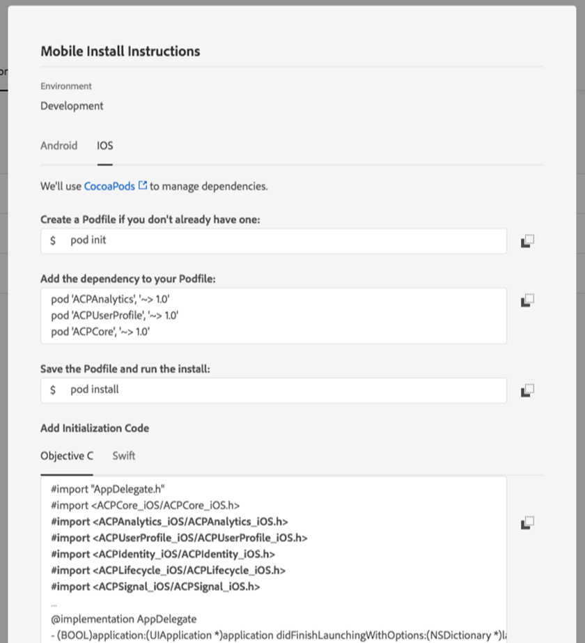

# Get the Experience Platform SDK

The Adobe Experience Platform SDK is available for Apple iOS \(includes iOS, iPadOS, and tvOS\) via [Cocoapods](https://cocoapods.org/), for Google Android via [Gradle](https://gradle.org), and for various cross-platform platforms such as Cordova, Flutter, React Native, Unity, and Xamarin.

Follow the directions below to include the SDK into your mobile application.

>[!NOTE]
>
>For iOS and Android projects, the recommended approach for integrating the SDK is to use supported dependency and package managers as listed for >each platform such as Maven and Cocoapods. SDKs are also available for download on [GitHub](https://github.com/Adobe-Marketing-Cloud/acp-sdks/).


## Java / Kotlin

>[!WARNING]
>
>Adobe Experience Platform SDKs for Android supports Android 4.0 \(API 14\) or later.


1. Open the mobile property you created earlier in Experience Platform Launch.
2. On your mobile property's details page, click on the **Environments** tab.

   The **Environments** tab lists the different environments where you can publish.

3. In the row for the **Development** environment, click on the install package icon \(\).

   You should see a dialog box similar to the following:

   

4. On the **Mobile Install Instructions** dialog box, make sure you are on the **Android** tab.
5. Follow the instructions for using Gradle with Android.

   The necessary dependencies and initialization code can be copied from the dialog box to your mobile application project.

>[!__BETA_TAB iOS (AEP 3.x)]

>[!WARNING]
>
>Adobe Experience Platform SDKs for iOS support **iOS 10 or later**; **\*\*requires** Swift 5.1 or newer; **and** Xcode 11.0 or newer\*\*.

>[!NOTE]
>
> ## Apple M1 compatibility
> 
> In order to support the new Apple M1 architecture while maintaining support for existing Intel architecture, the Adobe Experience Platform SDKs are now distributed using XCFrameworks.

## iOS \(Swift\) version 3.x

Add the dependencies to your `Podfile` for each extension. For a complete list of available SDK extension libraries, please read the documentation on [current SDK Versions](aembug.md).

```swift
use_frameworks!
target 'YourTargetApp' do
    // Mobile Core and dependents
    pod 'AEPCore'
    pod 'AEPSignal'
    pod 'AEPLifecycle'

    // Client-side user profile
    pod 'AEPUserProfile'

    // Edge Network and dependents
    pod 'AEPEdge'
    pod 'AEPEdgeIdentity'
    pod 'AEPEdgeConsent'

    // Adobe Analytics and dependents
    pod 'AEPIdentity'
    pod 'AEPAnalytics'
end
```

>[!__BETA_TAB iOS (ACP 2.x)]


>[!WARNING]
>
>Adobe Experience Platform SDKs for iOS support **iOS 10 or later**; **\*\*requires** Swift 5.1 or newer; **and** Xcode 11.0 or newer\*\*.

>[!NOTE]
>
> ### Apple M1 compatibility
> 
> In order to support the new Apple M1 architecture while maintaining support for existing Intel architecture, the Adobe Experience Platform SDKs are now distributed using XCFrameworks.
> 
> Please see the [release notes](aembug.md) and the document on [current SDK versions](aembug.md) for more NOTErmation on the latest extension versions.


1. Open a previously created and configured **Mobile** property in Launch, and click on the **Environments** tab, and then click on the install package icon \(\).
2. On the **Mobile Install Instructions** dialog box, select **iOS**.
3. Follow the instructions for using CocoaPods with iOS.
4. Under the initialization code, choose Objective C or Swift.

The necessary dependencies and initialization code can be copied from the dialog box to your app project.

You should see a pop-up similar to the following image:



## React Native

Adobe Experience Platform Mobile SDK plugin for React Native supports React Native **version 0.60.0 or later**. For the latest installation instructions, see the `README` file in the [`react-native-acpcore`](https://github.com/adobe/react-native-acpcore) repository.

>[!NOTE]
>
> For React Native, you should install [Node.js](https://nodejs.org) to download packages from [npm](https://npmjs.com). For additional instructions, see this [tutorial on getting started with React Native applications](https://facebook.github.io/react-native/docs/getting-started).
>
> v2.0.0 and above of the AEP Mobile SDK React Native plugins use [autolinking](https://github.com/react-native-community/cli/blob/master/docs/autolinking.md), which links plugins' native dependencies automatically. For iOS development, after installing the plugins from npm, download the pod dependencies by running the following command:
>
> `cd ios && pod install && cd ..`
>
> To update native dependencies to latest available versions, run the following command:
>
>
> `cd ios && pod update && cd ..`

>[!__BETA_TAB Flutter]


## Flutter

Adobe Experience Platform Mobile SDK plugin for Flutter supports Flutter **versions 1.10.0 or later**.

For the latest Flutter installation instructions, see the package [install tab](https://pub.dev/packages/flutter_acpcore#-installing-tab-).

>[!__BETA_TAB Cordova]


## Cordova

Adobe Experience Platform Mobile SDK plugins for Cordova supports Cordova **versions 9.0.0 or later**. For the latest Cordova installation instructions, see the `README` file in the [`cordova-acpcore`](https://github.com/adobe/cordova-acpcore) repository.

>[!NOTE]
> For Cordova, you should install [Node.js](https://nodejs.org/en/) to download packages from npm. For additional instructions, see this [guide to get started with Cordova applications](https://netbeans.apache.org/kb/docs/webclient/cordova-gettingstarted.html).

With Node.js installed, you can install the Cordova framework from terminal using the following statement:

```text
sudo npm install -g cordova
```

To start using the Adobe Experience Platform Mobile SDK plugin for Cordova, navigate to the directory of your Cordova app and install the plugins using the following statement:

```text
cordova plugin add https://github.com/adobe/cordova-acpcore.git
```

>[!__BETA_TAB Unity]


## Unity

>[!WARNING]
> Adobe Experience Platform SDKs plugins for Unity supports **Unity versions 2019.3.10f1 or later**

>[!NOTE]
> For the latest Unity installation instructions, see the README file in the [unity-acpcore](https://github.com/adobe/unity-acpcore) repository.
> 
To start using the Adobe Experience Platform Mobile SDK for Unity, open your application and import the requisite Unity packages.

For instance, to add the Mobile Core extension, you should:

* Download [ACPCore-0.0.1-Unity.zip](https://github.com/adobe/unity-acpcore/blob/master/bin/ACPCore-0.0.1-Unity.zip)
* Unzip `ACPCore-0.0.1-Unity.zip`
* Import `ACPCore.unitypackage` via Assets-Import Package

>[!__BETA_TAB Xamarin]


## Xamarin

Adobe Experience Platform Mobile SDK plugins for Xamarin require **MonoAndroid 9.0+ and Xamarin.iOS 1.0+**. For the latest Xamarin installation instructions, see the `README` file in the [`xamarin-acpcore`](https://github.com/adobe/xamarin-acpcore) repository.

>[!NOTE]
>
> The Adobe Experience Platform Mobile SDK plugins for Xamarin are packages distributed via [nuget](https://www.nuget.org/packages). NuGet packages can be added to projects within a [Visual Studio](https://visualstudio.microsoft.com/downloads/) solution. The NuGet packages can also be generated locally via the included Makefile located in each of the Xamarin repositories.
