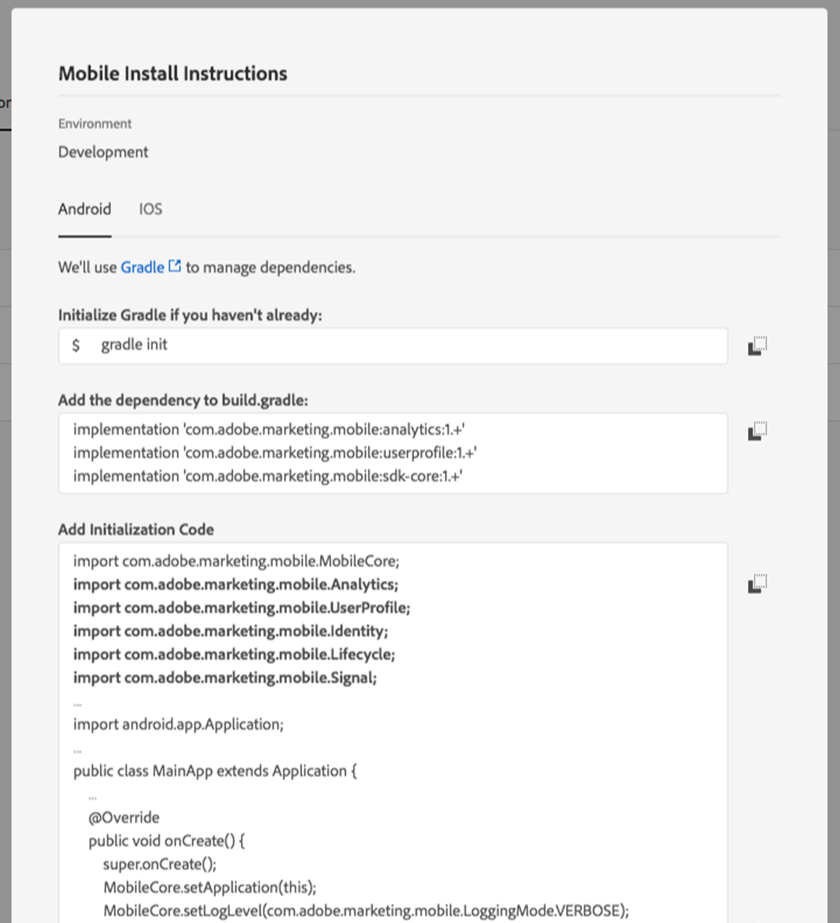

# HTML image link with caps

**HTML image link**

` `

Rendered?:

 

**Markdown image link**

`{width="500"}`

Rendered?"

{width="500"}

**HTML image link (no caps)**

` `

Rendered?:

 

**HTML image link without width**

` `

Rendered?:

 

Double quotes

 
