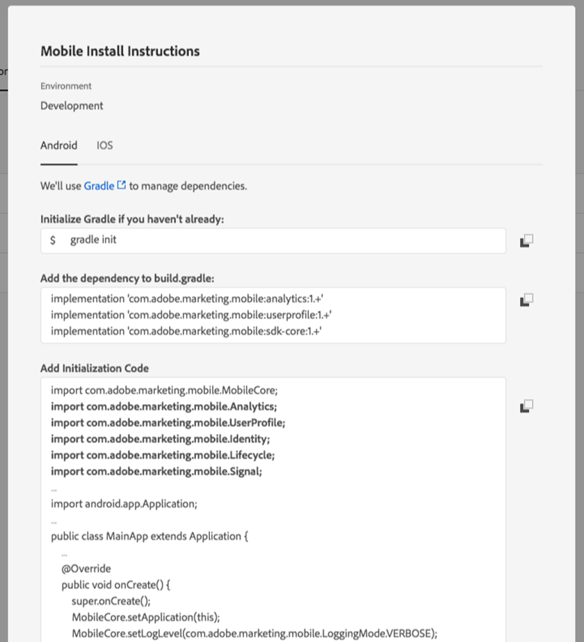

## Description

Most of the time, workflows make up part of the core features (built-in or custom) of the platform. For this reason, it's very important to take care when configuring them.

## Resolution

General configuration

Organization

Create your workflows, such as *import in tableXXX,* in a custom folder.

Only if the generic workflow affects the whole platform (cleansing for example) could you consider adding it in the built-in "Technical Workflows" folder.

Workflow name

As explained earlier, it is really important to give workflows proper names and labels. As an operator won't always refer to the documentation, fill in the workflow's <b>[!UICONTROL Description]</b> field to summarize the process to be performed.

If the workflow is part of a process involving multiple workflows, feel free to be explicit when entering a label; using numbers is a great way to order the workflows (by Label). For example:

- 001 – Import – Import recipients
- 002 – Import – Import sales
- 003 – Import – Import sales details
- 010 – Export – Export delivery logs
- 011 – Export – Export tracking logs

{.zoom-image .is-pulled-left}

{.zoom-image .is-pulled-left}

 {.zoom-image .is-pulled-right}

{.zoom-image .is-pulled-left}

{.zoom-image .is-pulled-left}
