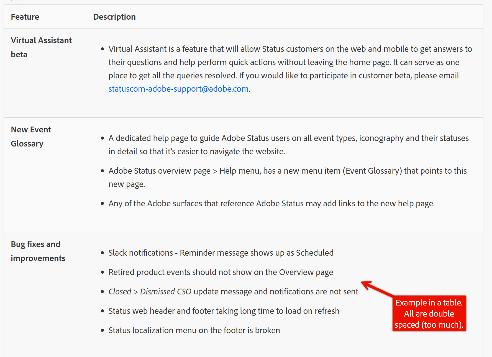
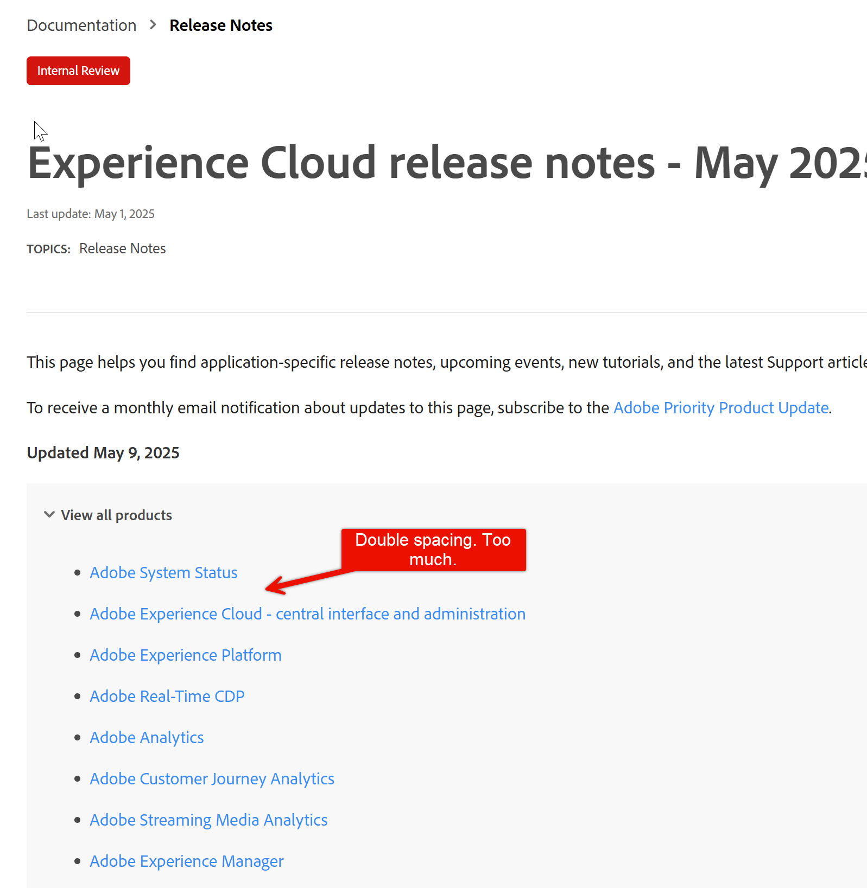
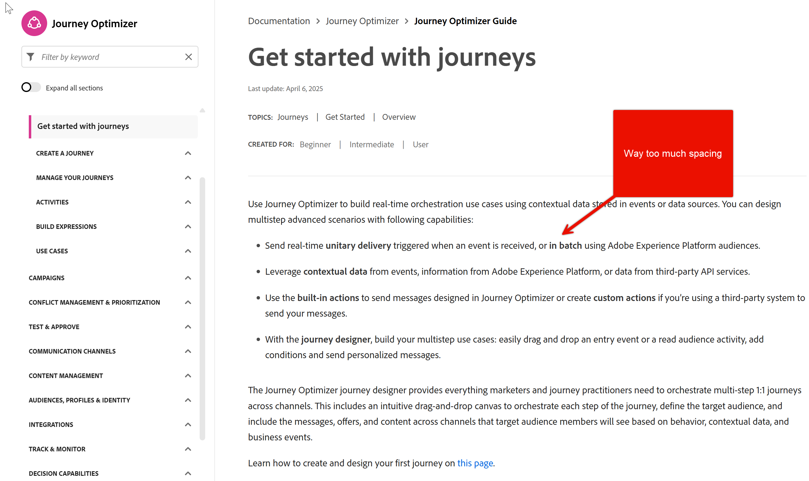
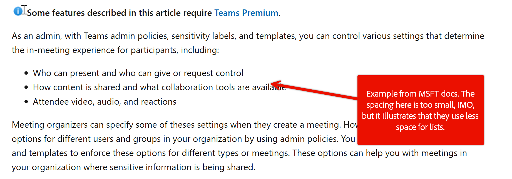
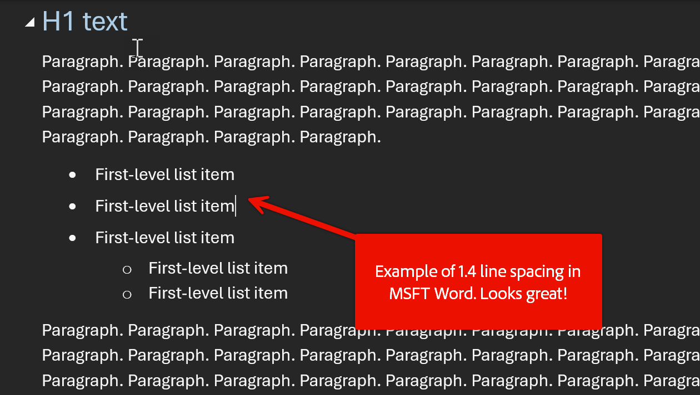

# Spacing in lists

See [UGP-13107](https://jira.corp.adobe.com/browse/UGP-13107)

See also spacing in Microsoft docs: <https://learn.microsoft.com/en-us/microsoft-365/solutions/empower-people-to-work-remotely?view=o365-worldwide>

## Images

## Release notes example

This page helps you find application-specific release notes, upcoming events, new tutorials, and the latest Support articles on Experience League. 

To receive a monthly email notification about updates to this page, subscribe to the [Adobe Priority Product Update](https://www.adobe.com/subscription/priority-product-update.html). 

**Updated May 12, 2025**

+++View all products

* [[!DNL Adobe System Status]](#status)
* [[!DNL Adobe Experience Cloud] - central interface and administration](#ecloud) (Updated: **May 12**)
* [[!DNL Adobe Experience Platform]](#platform) 
* [[!DNL Adobe Real-Time CDP]](#rtcdp)
* [[!DNL Adobe Analytics]](#analytics) 
* [[!DNL Adobe Customer Journey Analytics]](#cja) 
* [[!DNL Adobe Streaming Media Analytics]](#sma)
* [[!DNL Adobe Experience Manager]](#aem) 
* [[!DNL Adobe Commerce]](#commerce)
* [[!DNL Adobe Target]](#target) 
* [[!DNL Adobe Campaign]](#ac) 
* [[!DNL Adobe Journey Optimizer]](#journey-opt)
* [[!DNL Adobe Journey Optimizer B2B Edition]](#ajo-b2b)
* [[!DNL Adobe Marketo Engage]](#marketo)
* [[!DNL Adobe Workfront]](#workfront)
* [[!DNL Adobe GenStudio for Performance Marketing]](#genstudio-marketing) 
* [[!DNL Adobe Mix Modeler]](#mix-modeler)
* [[!DNL Adobe Advertising]](#advertising) 
* [[!DNL Adobe Pass]](#pass)
* [[!DNL Adobe Document Cloud]](#doc-cloud)
* [[!DNL Adobe Creative Cloud for enterprise]](#creative-cloud)
* [Customer Data Management - Voices](#voices)
* [Digital Experience Blueprints](#blueprints)
* [Certification at Adobe](https://experienceleague.adobe.com/en/certification-home)
* [Adobe product security vulnerabilities](https://helpx.adobe.com/security.html)

+++ 

## [!DNL Adobe System Status]

[!DNL Adobe System Status] provides detailed information, status updates, and email notifications about Adobe products and services. Get notified about outages, disruptions, and maintenance events. Check it out at [status.adobe.com](https://status.adobe.com/).

+++Latest release notes

Release date: **March 20, 2025**

**What's new**

* Virtual Assistant beta
* New Event Glossary help page
* Bug fixes and improvements

| Feature | Description |
| ------- | ------- |
| **Virtual Assistant beta** | <ul><li>Virtual Assistant is a feature that will allow Status customers on the web and mobile to get answers to their questions and help perform quick actions without leaving the home page. It can serve as one place to get all the queries resolved. If you would like to participate in customer beta, please email [statuscom-adobe-support@adobe.com](mailto:statuscom-adobe-support@adobe.com). </li></ul>|
| **New Event Glossary** | <ul><li>A dedicated help page to guide [!DNL Adobe Status] users on all event types, iconography and their statuses in detail so that it's easier to navigate the website.</li><li>Adobe Status overview page > Help menu, has a new menu item (Event Glossary) that points to this new page.</li><li>Any of the Adobe surfaces that reference [!DNL Adobe Status] may add links to the new help page.</li></ul> |
| **Bug fixes and improvements** | <ul><li>Slack notifications - Reminder message shows up as Scheduled</li><li>Retired product events should not show on the Overview page</li><li>_Closed_ > _Dismissed CSO_ update message and notifications are not sent</li><li>Status web header and footer taking long time to load on refresh</li><li>Status localization menu on the footer is broken</li></ul> |

Previous release notes for [!DNL Adobe System Status]:

* [August 2024](https://experienceleague.adobe.com/en/docs/release-notes/experience-cloud/previous/2024/09142023#status)
* [May 2024](https://experienceleague.adobe.com/en/docs/release-notes/experience-cloud/previous/2024/05152024#status)
* [January 2024](https://experienceleague.adobe.com/en/docs/release-notes/experience-cloud/previous/2024/02142024#status)
* [October 2023](https://experienceleague.adobe.com/en/docs/release-notes/experience-cloud/previous/2023/10042023#status)
* [August 2023](https://experienceleague.adobe.com/en/docs/release-notes/experience-cloud/previous/2023/08092023#status)
* [March 2023](https://experienceleague.adobe.com/en/docs/release-notes/experience-cloud/previous/2023/03082023#status)
* [January 2023](https://experienceleague.adobe.com/en/docs/release-notes/experience-cloud/previous/2023/02082023#status)

+++

## Journeys exampl

Use [!DNL Journey Optimizer] to build real-time orchestration use cases using contextual data stored in events or data sources. You can design multistep advanced scenarios with following capabilities:

* Send real-time **unitary delivery** triggered when an event is received, or **in batch** using Adobe Experience Platform audiences.

* Leverage **contextual data** from events, information from Adobe Experience Platform, or data from third-party API services.

* Use the **built-in actions** to send messages designed in [!DNL Journey Optimizer] or create **custom actions** if you're using a third-party system to send your messages.

* With the **journey designer**, build your multistep use cases: easily drag and drop an entry event or a read audience activity, add conditions and send personalized messages.

The Journey Optimizer journey designer provides everything marketers and journey practitioners need to orchestrate multi-step 1:1 journeys across channels. This includes an intuitive drag-and-drop canvas to orchestrate each step of the journey, define the target audience, and include the messages, offers, and content across channels that target audience members will see based on behavior, contextual data, and business events.

Learn how to create and design your first journey in [this page](https://www.adobe.com).

➡️ Wait, what's this icon? ➡️

## Use cases{#uc-journey}

From within the journey designer, marketers can send real-time triggered 1:1 messages through any channel when an event occurs. For example, when a customer subscribes to a service, it can [trigger a welcome email](https://www.adobe.com), encouraging them to log into the app for the first time and set their preferences. Actions like completing the purchase, opening the email, and logging into the app can be used to advance new customers through their journeys.

The [journey designer](https://www.adobe.com) provides [built-in channel actions](https://www.adobe.com) that support outbound messages, such as emails, push notifications, and SMS/MMS, as well as inbound channels, including mobile apps, websites, and code-based experiences built directly within Journey Optimizer. You can also use third-party systems to send messages — whether via email, text, or other channels — Journey Optimizer includes [custom actions](https://www.adobe.com) to allow these systems to be integrated into journeys directly from the journey designer.

Learn how to build journeys in the following end-to-end use cases:

* [Send multi-channel messages](https://www.adobe.com)
* [Send a message using Campaign v7/v8](https://www.adobe.com)
* [Send a message to subscribers](https://www.adobe.com)
* [Pass collections dynamically using custom actions](https://www.adobe.com)
* [Limit throughput with External Data Sources and Custom Actions](https://www.adobe.com)

>[!NOTE]
>
>Journey guardrails and limitations are detailed in [this page](https://www.adobe.com)
