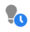
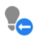

# Marketo Engage Icon Glossary Fragment 1

## Batch Campaigns {#batch-campaigns}

<table> 
 <tbody>
  <tr>
   <th>Old Icon</th> 
   <th> New Icon</th> 
   <th>Description</th> 
  </tr>
  <tr>
   <td></td> 
   <td></td> 
   <td>Has Run, No Upcoming</td> 
  </tr>
  <tr>
   <td></td> 
   <td></td> 
   <td>Invalid</td> 
  </tr>
  <tr>
   <td></td> 
   <td></td> 
   <td>Never Run</td> 
  </tr>
  <tr>
   <td></td> 
   <td></td> 
   <td>Running, in Wait Step</td> 
  </tr>
  <tr>
   <td></td> 
   <td></td> 
   <td>Scheduled to Run</td> 
  </tr>
  <tr>
   <td></td> 
   <td></td> 
   <td>Scheduled to Run Again</td> 
  </tr>
  <tr>
   <td></td> 
   <td></td> 
   <td>Used By Nurture</td> 
  </tr>
 </tbody>
</table>

## Trigger Campaigns {#trigger-campaigns}

<table> 
 <tbody>
  <tr>
   <th>Old Icon</th> 
   <th> New Icon</th> 
   <th>Description</th> 
  </tr>
  <tr>
   <td></td> 
   <td></td> 
   <td>Active</td> 
  </tr>
  <tr>
   <td></td> 
   <td></td> 
   <td>Is Requested</td> 
  </tr>
  <tr>
   <td><strong>n/a</strong></td> 
   <td></td> 
   <td>Inactive</td> 
  </tr>
  <tr>
   <td></td> 
   <td></td> 
   <td>Invalid</td> 
  </tr>
 </tbody>
</table>

## Email Programs {#email-programs}

<table> 
 <tbody>
  <tr>
   <th>Old Icon</th> 
   <th> New Icon</th> 
   <th>Description</th> 
  </tr>
  <tr>
   <td></td> 
   <td></td> 
   <td>Aborted</td> 
  </tr>
  <tr>
   <td></td> 
   <td></td> 
   <td>Completed</td> 
  </tr>
  <tr>
   <td></td> 
   <td></td> 
   <td>Not Approved</td> 
  </tr>
  <tr>
   <td></td> 
   <td></td> 
   <td>Scheduled</td> 
  </tr>
 </tbody>
</table>

## Engagement Programs {#engagement-programs}

<table> 
 <tbody>
  <tr>
   <th>Old Icon</th> 
   <th> New Icon</th> 
   <th>Description</th> 
  </tr>
  <tr>
   <td></td> 
   <td></td> 
   <td>Off</td> 
  </tr>
  <tr>
   <td></td> 
   <td></td> 
   <td>On</td> 
  </tr>
 </tbody>
</table>

## In-App Programs {#in-app-programs}

<table> 
 <tbody>
  <tr>
   <th>Old Icon</th> 
   <th> New Icon</th> 
   <th>Description</th> 
  </tr>
  <tr>
   <td></td> 
   <td></td> 
   <td>Approved</td> 
  </tr>
  <tr>
   <td></td> 
   <td></td> 
   <td>Not Configured Yet</td> 
  </tr>
  <tr>
   <td></td> 
   <td></td> 
   <td>Paused</td> 
  </tr>
  <tr>
   <td><strong>n/a</strong></td> 
   <td></td> 
   <td>Scheduled</td> 
  </tr>
  <tr>
   <td></td> 
   <td></td> 
   <td>Stopped</td> 
  </tr>
 </tbody>
</table>

## Assets {#assets}

<table> 
 <tbody>
  <tr>
   <th>Old Icon</th> 
   <th> New Icon</th> 
   <th>Description</th> 
  </tr>
  <tr>
   <td></td> 
   <td></td> 
   <td>Approved</td> 
  </tr>
  <tr>
   <td></td> 
   <td></td> 
   <td>Draft</td> 
  </tr>
  <tr>
   <td></td> 
   <td></td> 
   <td>Approved with Draft</td> 
  </tr>
 </tbody>
</table>

## Segments {#segments}

<table> 
 <tbody>
  <tr>
   <th>Old Icon</th> 
   <th> New Icon</th> 
   <th>Description</th> 
  </tr>
  <tr>
   <td><strong>n/a</strong></td> 
   <td></td> 
   <td>Approved - under calculation</td> 
  </tr>
  <tr>
   <td><strong>n/a</strong></td> 
   <td></td> 
   <td>Approved - under recalculation</td> 
  </tr>
  <tr>
   <td><strong>n/a</strong></td> 
   <td></td> 
   <td>Draft - under calculation</td> 
  </tr>
 </tbody>
</table>
